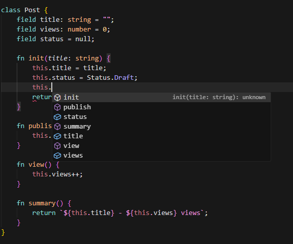

<div align="center">
  
  <h1>✨ Tiny Programming Language</h1>
  <p><b>Small. Fast. Expressive.</b></p>
  <p>Tiny is a lightweight scripting language and stack-based bytecode VM written in Go.</p>

  <p>
    
    
    
    
  </p>
</div>

---

## 🚀 Experience Tiny

Tiny sits in the "sweet spot" between a quick bash script and a complex Go program. It’s perfect for CLI tools, JSON automation, HTTP services, and native-plugin experiments.

<p align="center">
  
</p>

### Why use Tiny?
- 🍃 **Ultra-Lightweight**: Bare "Hello World" starts at **< 2MB** RAM (Node.js is ~30MB).
- 📦 **Zero Dependencies**: Compile your script into a **single standalone binary** with `tiny pack`.
- ⚡ **Built for Speed**: Uses a specialized bytecode compiler and an optimized stack VM.
- 🛠️ **Familiar Syntax**: Clean C-style syntax with Classes, Closures, and modern string interpolation.
- 🏗️ **Memory Safe**: Inherits Go's highly efficient concurrent Garbage Collector.

---

## 🛠️ Installation

### Quick Install (Pre-built)
If you don't want to build from source, you can download the pre-compiled binaries for your OS.

1.  **Download**: Get the latest binary from the [Releases Page](https://github.com/confh/Tiny/releases/latest).
    - Windows: `tiny_windows_amd64.exe`
    - Linux: `tiny_linux_amd64`
2.  **Setup Folder**: Create a `.tiny` folder in your user home directory and move the binary there.
    - Windows: `C:\Users\YourName\.tiny\tiny.exe` (Rename it to `tiny.exe`)
    - Linux: `~/.tiny/tiny` (Rename it to `tiny` and run `chmod +x ~/.tiny/tiny`)
3.  **Add to PATH**:
    - **Windows**: Search for "Environment Variables" -> Edit the system environment variables -> Path -> New -> add `C:\Users\YourName\.tiny`.
    - **Linux**: Add `export PATH="$HOME/.tiny:$PATH"` to your `~/.bashrc` or `~/.zshrc`.

### Build from Source
Build the `tiny` compiler/runtime directly:

```bash
# Clone the repo
git clone https://github.com/confh/Tiny.git tiny
cd tiny

# Build (Linux)
./build.sh

# Build (Windows)
.\build.bat
```

---

## 🚦 Features at a Glance

| Category | Highlights |
| :--- | :--- |
| **Language** | Variables (`let`/`const`), Functions, Classes (Fields/Methods), Enums, Namespaces, Try/Catch |
| **Data** | Strings (Interpolated), Numbers (Int/Float/Int64/Uint64), Arrays, Objects, Buffers |
| **Runtime** | Optimized Bytecode VM, Native Method Dispatch, Async Tasks (`spawn`/`await`) |
| **Distribution** | Bytecode Serialization (`.tbc`), Single-binary Packing, `dist` folder generation |
| **Std Lib** | `io`, `fs`, `json`, `http` (Client/Server), `net`, `process`, `regex`, `desktop`, `math` |

---

## 🌐 Modern Tooling

Tiny comes with built-in tools to manage your entire development lifecycle.

### 🔌 Real-time HTTP Services
Write and run a JSON API in seconds. Tiny includes a full-featured HTTP server.

<p align="center">
  
</p>

### 📦 Single-Binary Packing
Stop shipping source files. Pack your Tiny app into a standalone executable for Windows or Linux.

<p align="center">
  
</p>

### 🛠️ VS Code Support
Tiny features a built-in **Language Server (LSP)** for a modern development experience. Download the official extension for syntax highlighting, autocompletion, and diagnostics.



<br/>

👉 **[Tiny for Visual Studio Code](https://github.com/confh/TinyVsCode/releases/latest)**

---

## 🛠️ Project Management

Tiny includes built-in tools to manage your entire development lifecycle, making it easy to grow from a single script to a full application.

### Bootstrapping with `tiny init`
Create a new project with a standardized structure in one command:
```bash
tiny init my-awesome-app
cd my-awesome-app
```
This generates:
- `src/main.tiny`: Your application entry point.
- `tiny.json`: The project manifest and configuration.
- `plugins/`: A home for your native plugins.
- `.gitignore`: Pre-configured for Tiny's build artifacts.

### The `tiny.json` Manifest
The `tiny.json` file is the brain of your project. It controls how your app runs, builds, and packs.
```json
{
  "name": "my-app",
  "version": 0.1,
  "entry": "src/main.tiny",
  "target": "windows-amd64",
  "scripts": {
    "test": "tiny test.tiny",
    "clean": "rm -rf dist/*"
  }
}
```

### Custom Scripts with `tiny task`
Forget complex Makefiles. Define your project's workflow directly in `tiny.json` and run them with `tiny task`.
```bash
tiny task        # Lists all available tasks
tiny task test   # Runs your custom 'test' script
```
> **Pro Tip**: If you simply run `tiny` (no arguments) in a project folder, it will automatically look for `tiny.json` and execute the `entry` file.

---

## ⚙️ Under the Hood: Performance & Optimizations

Tiny isn't just an AST interpreter; it's a full compilation pipeline designed for efficiency.

- 🏗️ **Bytecode Compiler**: Source code is compiled into a compact binary instruction stream (`.tbc`) before execution.
- 🚀 **Optimized Dispatch**: The VM uses specialized instructions for common patterns like `OP_INC_LOCAL` or `OP_ARRAY_PUSH_LOCAL`, bypassing slower generic method lookups.
- 💎 **Constant Folding**: The compiler pre-calculates static expressions (like `1 + 2 * 3`) at compile-time.
- 📦 **Fast Local Access**: Local variables are indexed by numeric slots, making function scope access extremely fast.
- ♻️ **Go GC Integration**: Tiny values are directly backed by Go's highly efficient, concurrent, tri-color mark-and-sweep garbage collector.
- 💾 **Source Cache**: When running `.tiny` files directly, Tiny caches the compiled bytecode in a `.tinycache` folder, making subsequent runs near-instant.

---

## 📦 Distribution & Deployment

Tiny provides multiple ways to ship your code, from raw source to standalone system binaries.

### 1. Standalone Executables (`tiny pack`)
The easiest way to distribute your tool. It bundles the Tiny runtime and your compiled bytecode into a single binary.
```bash
tiny pack src/main.tiny -o mytool
```

### 2. Full Distribution (`tiny dist`)
If your project uses **Native Plugins** (DLLs/SOs), `tiny dist` is the answer. It packs the executable *and* automatically gathers all linked plugins into a clean `dist/` folder.
```bash
tiny dist src/main.tiny -o release/app
```

### 3. Bytecode Binary (`tiny build`)
If you want to keep your source private but don't need a standalone binary, you can ship the `.tbc` file.
```bash
tiny build src/main.tiny -o app.tbc
tiny run app.tbc
```

---

## 📖 Language Tour

### Classes & Logic
```javascript
import std "io";

class Greeter {
    field prefix = "Hello";
    fn init(p) { this.prefix = p; }
    fn greet(name) {
        return `${this.prefix}, ${name}!`;
    }
}

let g = Greeter("Welcome");
io.println(g.greet("Gemini"));
```

### JSON & File IO
```javascript
import std "io";
import std "fs";
import std "json";

let data = { user: "David", score: 100 };
fs.writeFile("save.json", json.pretty(data));

let loaded = json.parse(fs.readFile("save.json"));
io.println(`User: ${loaded.user}`);
```

### Async Tasks
```javascript
import std "io";
import std "time";

let task = spawn fn() {
    time.sleep(1000);
    return "Result from background!";
};

io.println("Doing other things...");
io.println(task.await());
```

---

## 📚 Standard Library Reference

Tiny includes a robust set of standard modules:

- **`io`**: Print, Input, ReadLine.
- **`fs`**: File management (Open, Read, Write, Stat, ReadDir).
- **`json`**: High-performance JSON Parsing and Stringifying.
- **`http`**: Clean HTTP Client and Server.
- **`process`**: Environment variables, CLI args, running shell commands.
- **`math`**: Full trig, clamping, and even **Matrix Multiplication**.
- **`desktop`**: Control mouse/keyboard and take screenshots.

---

## 🏗️ Repository Structure

- `src/vm/`: The heart of Tiny — Lexer, Parser, Compiler, and the VM.
- `src/bytecode/`: Serialization logic for `.tbc` files.
- `src/tinyplugin/`: A Go-based helper to write native C-shared plugins.
- `examples/`: Comprehensive guides for every feature.

---

<div align="center">
  <p>Tiny is intentionally small, focusing on readability and iterate-ability.</p>
  <p>Made with ❤️ using Go.</p>
</div>
