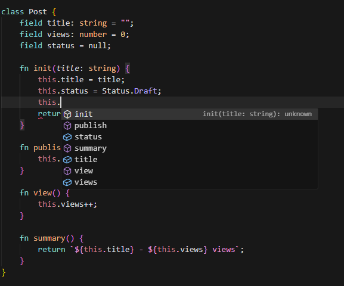

<div align="center">
  
  <h1>Tiny Programming Language</h1>
  <p><b>A high-performance, concurrent bytecode virtual machine and language written in Go.</b></p>
  <p>Tiny combines the development speed of dynamic coding with a robust, multi-threaded runtime engine.</p>

  <p>
    
    
    
    
  </p>
</div>

---

Tiny bridges the gap between high-level dynamic languages and strict compiled systems. It compiles human-readable source code into compact binary bytecode instructions executed on a custom stack-based VM. It is highly optimized for concurrent network services, desktop automation, and lightweight standalone tool distribution.

Check out the [examples](https://github.com/confh/Tiny/tree/master/examples) to see Tiny in action.

<p align="center">
  
</p>

## Core Features

* **True Concurrency:** Native OS-level multi-threading via Go-backed scheduler loops. Spawn parallel tasks seamlessly using the `spawn` keyword.
* **Thread Safety:** Built-in mutex engine featuring a native `lock` block syntax to automatically manage mutex acquisition and release, preventing common deadlock scenarios.
* **Hybrid Type System:** Dynamically typed for rapid prototyping, with full support for optional static type hints and structural interfaces (shape-based validation).
* **Compiled Performance:** Translates source code into structured bytecode (`.tbc`). Features in-place instruction fusing, constant folding, and flat slot-based variable lookups.
* **Self-Contained Distribution:** Single-command packaging (`tiny pack`) bundles your bytecode and the runtime interpreter into an independent, obfuscated ~9MB native executable.
* **Production-Ready Standard Library:**
  * `http` (Fully concurrent HTTP client and microservices server architecture - capable of handling 45,000+ requests per second)
  * `desktop` (Cross-platform mouse, keyboard, and clipboard automation)
  * `json` (High-performance parsing/serialization directly mapped to Go streams)
  * `io`, `fs`, `math` (featuring matrix multiplication), `regex`, `sync`, and `test` (integrated unit testing framework).
* **Native Plugin Architecture:** High-performance FFI layer using lazyloading (Windows) and `purego` (Linux). Link external DLLs/SOs cleanly via JSON-serialized message protocols without breaking cross-compilation.
* **Inline Go Extensions:** Use the `native fn` keyword to write high-performance Go logic directly in your code. Code is compiled to WebAssembly via TinyGo for near-native speeds.

## VS Code Support

Tiny includes a native Language Server (LSP) providing advanced static analysis, type narrowing (refining types following conditional blocks), autocomplete, diagnostics, and jump-to-definition tracking.

<p align="center">
  
</p>

Download the VS Code extension by searching "Tiny" in the extension marketplace.

---

## Language Tour

### Structural Interfaces & Shape Validation
Objects are implicitly validated against structural interfaces at runtime based entirely on their properties.
```js
import std "io";

interface Task {
    title: string
    done: bool
}

fn complete(t: Task) {
    io.println(`Completing: ${t.title}`);
}

complete({ title: "Write Documentation", done: false });
```

### Native Classes & Encapsulation

```js
import std "io";

class Greeter {
    field prefix = "Hello";
    fn init(p) { this.prefix = p; }
    fn greet(name) {
        return `${this.prefix}, ${name}!`;
    }
}

let g = Greeter("Welcome");
io.println(g.greet("Tiny"));
```

### Concurrency & Parallel Threading

Tiny bypasses single-threaded event loops and Global Interpreter Locks (GIL). Tasks spawned run in parallel, backed by independent, isolated VM state spaces.

```js
import std "io";
import std "time";

let task = spawn () fn() {
    time.sleep(1000);
    return "Result from parallel thread!";
};

io.println("Main thread continuing execution...");
io.println(await task);
```

### High-Performance Native Functions (Go)
Write performance-critical logic in Go directly inside your Tiny code. Native functions are compiled to WebAssembly via [TinyGo](https://tinygo.org/) for near-native throughput. For example, a recursive Fibonacci implementation (`fib(30)`) executes in approximately **10ms**.

> **Note:** Compiling code with `native fn` requires **Go** and **TinyGo** to be installed on the host machine.

```js
import std "io";
import std "time";

native fn gosha256(input: string): string {
    go {
        import "crypto/sha256"
        import "encoding/hex"

        h := sha256.Sum256([]byte(input))
        return hex.EncodeToString(h[:])
    }
}

// Direct recursion within native blocks
native fn goFib(n: number): number {
    go {
        if n < 2 {return n }
        return goFib(n - 1) + goFib(n - 2)
    }
}

io.println(gosha256("Tiny is fast"));

const start = time.nowMs()

io.println(`Fibonacci(30): ${goFib(30)}`);

const end = time.nowMs()

io.println(`Native Fibonacci took ${end-start}ms`)
```

---

## Virtual Machine Architecture & Optimizations

Tiny compiles plain text source files into a dense, binary bytecode stream (`.tbc`) before execution. The stack-based VM utilizes several modern architectural design choices to maximize throughput:

* **Isolated VM State Cloning:** When `spawn` is invoked, the engine duplicates the call frame tracking structures and memory stack to isolate concurrent execution spaces. Shared resource operations are wrapped cleanly using native synchronization blocks:
```js
lock communicationMutex {
    // Thread-safe mutations happen here
}
```


* **Flat Slot-Based Access:** Resolution of local and global variables happens entirely during compilation. Variables are mapped to numerical indices within flat arrays inside execution frames, eliminating string-map lookups during runtime.
* **Instruction Fusing:** The pipeline runs an optimization pass over generated bytecode to compress patterns (e.g., fusing sequential loading, incrementing, and assignment operations into singular opcodes like `OP_INC_LOCAL`).
* **Automated Memory Tracking:** Tiny primitives integrate natively with Go's concurrent garbage collector, maintaining automatic memory cycles without manual allocation tracking.

---

## Bundling & Bytecode Security

### Standalone Packaging (`tiny pack`)

Compress and compile your script assets straight into a single native runtime executable:

```bash
tiny pack src/main.tiny -o mytool
```

### Cryptographic Asset Embedding

The `embedstr` and `embedbin` operations securely compile internal text configurations or assets straight into the binary stream, passing them through an automated XOR obfuscation layer to shield keys and strings from simple binary extraction attacks (such as the standard `strings` command):

```js
embedstr "./config.json" const config
embedbin "./icon.png" const iconBytes
```

### Production Shipments (`tiny dist`)

When working with native external shared libraries, the system resolves dependency tracking instantly, packaging the application along with any required `.dll` or `.so` native components into a clean target environment:

```bash
tiny dist src/main.tiny -o release/app
```

---
<div align="center">
  <p>Tiny Language © 2026 | MIT Licensed</p>
  <p>
    <a href="https://github.com/confh/Tiny/issues">Report an Issue</a> • 
    <a href="https://github.com/confh/Tiny/blob/main/LICENSE">License</a>
  </p>
</div>
